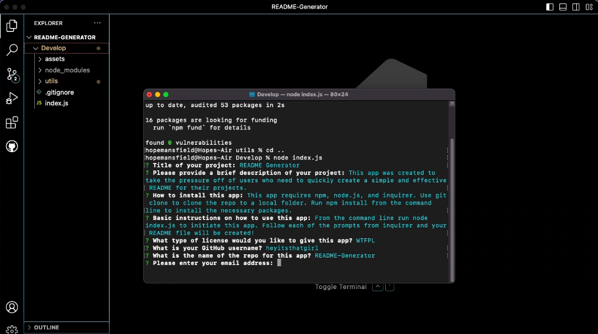
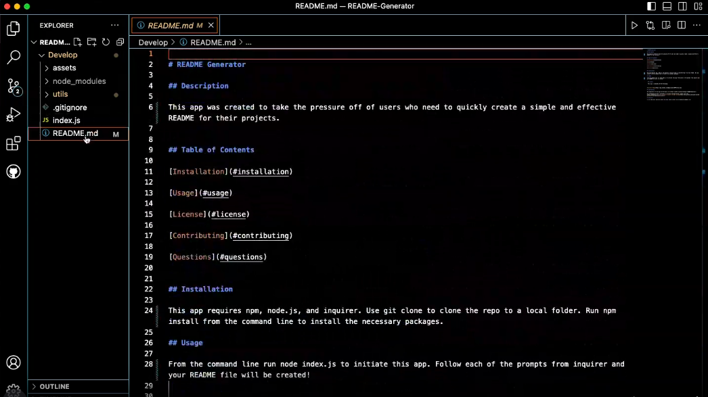

# README Generator

## Description

This app was created to take the pressure off of users who need to quickly create a simple and effective README for their projects.

## Table of Contents

[Installation](#installation)

[Usage](#usage)

[License](#license)

[Contributing](#contributing)

[Questions](#questions)

    
## Installation
    
This app requires npm, node.js, and inquirer. Use git clone to clone the repo to a local folder. Run npm install from the command line to install the necessary packages.
    
## Usage
    
From the command line run node index.js to initiate this app. Follow each of the prompts from inquirer and your README file will be created!

[

[

  ## License
    
  This app is licensed with the following:
    

[
    
## Contributing

The repository for this app can be found [here](https://github.com/heyitsthatgirl/README-Generator).

For information on how to contribute to a project through forking, please visit the 
GitHub documentation on [Contributing to projects through forking](https://docs.github.com/en/get-started/quickstart/contributing-to-projects).

## Questions
    
To ask additional questions about this app, please contact me at hopemansfield@gmail.com.
